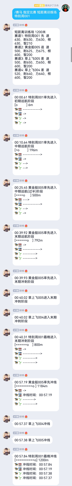

# UmamusumePlugin

赛马逻辑来自[umamusume-simulation项目](https://github.com/hundun000/umamusume-simulation)，模拟游戏《赛马娘》。

## 功能说明

从玩家拥有的马中选择一匹，随机匹配对手，然后观看比赛过程。

比赛过程中若干关键节点的描述（一场比赛约12个关键节点），会间隔一定时长（0.5~2秒，与模拟游戏中的时间间隔正相关）发出一段，以字符画的形式。比赛过程文字描述中的时间，指的是模拟游戏内的时间，总时长约1分半。对应真实世界的总时长约15秒。

更多功能待开发。

实际运行效果：  
<details>
<summary>展开/收起</summary>

  

</details>

## 准备工作

本项目提供的是mirai-console插件，用户应自行学习和准备好mirai-console。确保可以[在聊天环境执行指令](https://github.com/project-mirai/chat-command)。

本插件的指令受mirai-console权限系统管理，[权限授予说明](https://github.com/mamoe/mirai/blob/dev/docs/ConsoleTerminal.md#%E5%9C%A8%E7%BE%A4%E8%81%8A%E4%B8%AD%E4%BD%BF%E7%94%A8%E5%91%BD%E4%BB%A4-%E6%9D%83%E9%99%90%E6%8E%88%E4%BA%88)。且除了指令权限id`hundun.mirai.umamusume:command.umacommand`，还有一个特殊权限`hundun.mirai.umamusume.cos:INSTANCE`来作为本插件的服务开关（当同一个console里有多个bot加了同一个群，可控制仅单个bot使用本插件）。

#### 方式1：通过指令授权

[用PermissionCommand授权群员使用指令的权限](https://github.com/mamoe/mirai-console/blob/master/docs/BuiltInCommands.md#%E6%8E%88%E4%BA%88%E4%B8%80%E4%B8%AA%E7%94%A8%E6%88%B7%E6%89%A7%E8%A1%8C%E6%89%80%E6%9C%89%E6%8C%87%E4%BB%A4%E7%9A%84%E6%9D%83%E9%99%90)

用PermissionCommand授权特殊权限：
> /perm permit m111111.* hundun.mirai.umamusume:*
> 
> 表示允许111111群的任意群员使用本插件的所有指令
> 
> /perm permit m111111.222222 hundun.mirai.umamusume.cos:INSTANCE 
> 
> 表示bot账号222222在群1111111启用本插件。注意，这里的222222是bot自身的账号。

#### 方式2：直接编辑PermissionService.yml

授权后的config/Console/PermissionService.yml内容示例：
```
grantedPermissionMap: 
  ……
  'hundun.mirai.umamusume:*':             # 本插件所有指令权限
    - 'm111111.*'                         # 允许111111群的任意群员使用本插件的所有指令
  'hundun.mirai.umamusume.cos:INSTANCE':  # 特殊权限，表示本插件的开关
    - m111111.222222                      # bot账号222222在群1111111启用本插件。注意，这里的222222是bot自身的账号。
```

如此配置后，即使群1111111有多个bot账号，也只有账号222222会回应指令。

## 指令

#### 随机比赛

随机选择一场比赛，随机选择对手。

*<主指令>: 赛马*  
*<子指令>: 随机比赛*  
*<指令参数1>: 玩家所拥有的马的名字*

实际指令演示：  
>  -> /赛马 随机比赛 特别周001  
>  <- （若干段描述间隔发送）……

#### 指定比赛

指定一场比赛，随机选择对手。

*<主指令>: 赛马*  
*<子指令>: 指定比赛*  
*<指令参数1>: 比赛名*
*<指令参数2>: 玩家所拥有的马的名字*

实际指令演示：  
>  -> /赛马 指定比赛 短距离训练场 特别周001  
>  <- （若干段描述间隔发送）……

## 配置文件

插件载入后会自动在`config\hundun.mirai.umamusume\UmaCommand`创建默认配置文件`UmaConfig.json`。

配置内容简述：

-  玩家所拥有的马的详细数据（绘制出的字符画，可在此配置）
- 候选作为对手的马的详细数据
- 候选比赛的详细数据


更详细解释暂无，可（参考《赛马娘》原作游戏）自行理解，尝试调整数值。

配置文件样例节选：  
```json
{
  "SINGLETON" : {
    "playerHorses" : [ 
      {
        "name" : "特别周001",
        "baseSpeed" : 630,
        "baseStamina" : 630,
        "basePower" : 630,
        "baseGuts" : 630,
        "baseWisdom" : 210,
        "score" : 2730,
        "defaultRunStrategyType" : "FRONT",
        "distanceAptitudes" : {
          "SHORT" : "A",
          "MILE" : "A",
          "MEDIUM" : "A",
          "LONG" : "A"
        },
        "runStrategyAptitudes" : {
          "BACK" : "A",
          "FIRST" : "A",
          "FRONT" : "A",
          "TAIL" : "A"
        },
        "trackGroundAptitudes" : {
          "TURF" : "A",
          "DIRT" : "A"
        }
      },
      {……} 
    ],
    "races" : [
        {
          "name" : "短距离训练场",
          "lengthType" : "MILE",
          "groundType" : "TURF",
          "length" : 1200,
          "defaultHorseNum" : 4
        },
        {……}
    ],
    "rivalHorses" : [ 
        {……}
    ]
  }
}
```

## 其他

### 声明：一切开发旨在学习，请勿用于非法用途

- 本项目是完全免费且开放源代码的软件，仅供学习和娱乐用途使用
- 鉴于项目的特殊性，开发团队可能在任何时间**停止更新**或**删除项目**。