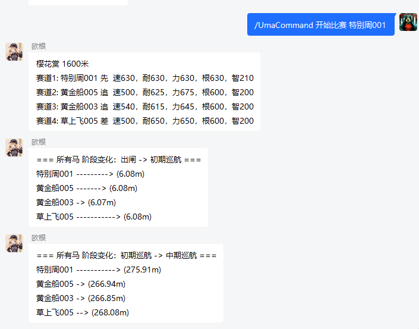

# UmamusumePlugin

赛马逻辑来自[umamusume-simulation项目](https://github.com/hundun000/umamusume-simulation)，模拟游戏《赛马娘》。

## 功能说明

从玩家拥有的马中选择一匹，随机匹配对手，然后观看比赛过程。比赛过程中若干关键节点的描述（一场比赛约8个关键节点），会每间隔2s发出一段。

更多功能待开发。

### 配置

插件载入后会自动在`config\hundun.mirai.umamusume\UmaCommand`创建默认配置文件`UmaConfig.json`。

玩家所拥有的马、以及候选作为对手的马，均在其中配置。

更详细解释暂无，可（参考《赛马娘》原作游戏）自行理解，尝试调整数值。

配置文件样例节选：  
```json
{
  "SINGLETON" : {
    "playerHorses" : [ {
      "name" : "特别周001",
      "baseSpeed" : 630,
      "baseStamina" : 630,
      "basePower" : 630,
      "baseGuts" : 630,
      "baseWisdom" : 210,
      "score" : 2730,
      "defaultRunStrategyType" : "FRONT",
      "distanceAptitudes" : {
        "SHORT" : "A",
        "MILE" : "A",
        "MEDIUM" : "A",
        "LONG" : "A"
      },
      "runStrategyAptitudes" : {
        "BACK" : "A",
        "FIRST" : "A",
        "FRONT" : "A",
        "TAIL" : "A"
      },
      "trackGroundAptitudes" : {
        "TURF" : "A",
        "DIRT" : "A"
      }
    },
    {……},
    {……} 
    ],
    "rivalHorses" : [ 
     {……},
     {……}
    ]
}
```

### 指令

*<主指令>: UmaCommand*  
*<子指令>: 开始比赛*  
*<指令参数1>: 玩家所拥有的马的名字*

>  -> /UmaCommand 开始比赛 特别周001  
>  <- （第1段描述）……
>   
>  <- （第2段描述）……
>  
>  <- （第3段描述）……
```

实际使用效果：  
  


## 其他

### 声明：一切开发旨在学习，请勿用于非法用途

- 本项目是完全免费且开放源代码的软件，仅供学习和娱乐用途使用
- 鉴于项目的特殊性，开发团队可能在任何时间**停止更新**或**删除项目**。